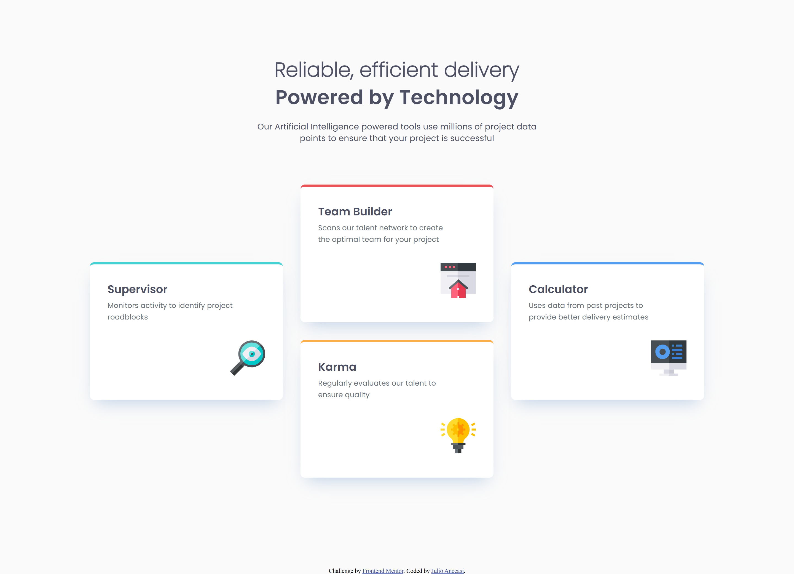
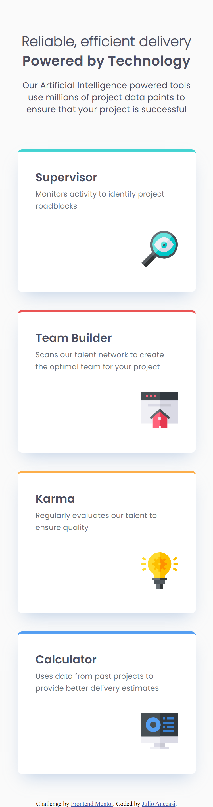
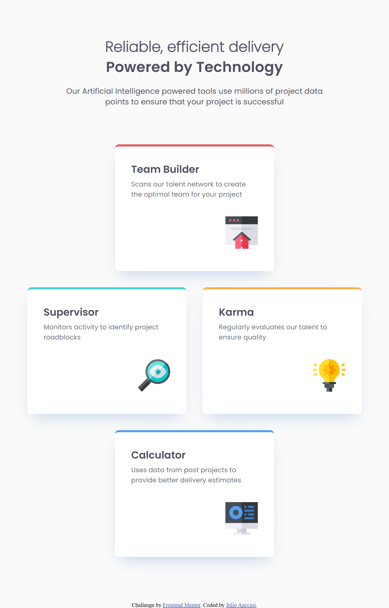

# Frontend Mentor - Four card feature section solution

This is a solution to the [Four card feature section challenge on Frontend Mentor](https://www.frontendmentor.io/challenges/four-card-feature-section-weK1eFYK). Frontend Mentor challenges help you improve your coding skills by building realistic projects.

## Table of contents

- [Frontend Mentor - Four card feature section solution](#frontend-mentor---four-card-feature-section-solution)
  - [Table of contents](#table-of-contents)
  - [Overview](#overview)
    - [The challenge](#the-challenge)
    - [Screenshot](#screenshot)
    - [Links](#links)
  - [My process](#my-process)
    - [Built with](#built-with)
    - [What I learned](#what-i-learned)
    - [Continued development](#continued-development)
    - [Useful resources](#useful-resources)
  - [Author](#author)
  - [Acknowledgments](#acknowledgments)

**Note: Delete this note and update the table of contents based on what sections you keep.**

## Overview

### The challenge

Users should be able to:

- View the optimal layout for the site depending on their device's screen size

### Screenshot





### Links

- Solution URL: [https://github.com/ChechiX/four-card-feature-section](https://github.com/ChechiX/four-card-feature-section)
- Live Site URL: [https://chechix.github.io/four-card-feature-section/](https://chechix.github.io/four-card-feature-section/)

## My process

### Built with

- Semantic HTML5 markup
- CSS custom properties
- Flexbox
- CSS Grid
- Mobile-first workflow
- [Sass](https://sass-lang.com/) - For styles

### What I learned

```scss
.card__wrapper {
  display: grid;
  gap: 2rem;
}

@media (min-width: 48rem) {
  grid-template-rows: repeat(3, 1fr);
  grid-template-columns: repeat(2, 1fr);
  justify-items: center;

  .service__section:nth-child(1) {
    grid-row: 2 / 3;
  }

  .service__section:nth-child(2) {
    grid-column: 1 / 3;
  }

  .service__section:nth-child(3) {
    grid-row: 2 / 3;
  }

  .service__section:nth-child(4) {
    grid-column: 1 / 3;
  }
}

@media (min-width: 64rem) {
  grid-template-columns: repeat(3, 1fr);
  grid-template-rows: repeat(2, 1fr);
  align-items: center;

  .service__section:nth-child(1) {
    grid-row: 1 / 3;
  }

  .service__section:nth-child(2) {
    grid-column: 2 / 3;
  }

  .service__section:nth-child(4) {
    grid-row: 1 / 3;
    grid-column: 3 / 4;
  }
}
```

### Continued development

I need to continue studying and practicing with CSS Grid because it's a very useful technology.

### Useful resources

- [Grid Garden](https://cssgridgarden.com/) - This website helped me a lot to get into Grid since it was my first time using Grid

## Author

- Frontend Mentor - [@ChechiX](https://www.frontendmentor.io/profile/ChechiX)

## Acknowledgments

I want to thank someone whose name I don't actually know, but who is known as @Darkstar in the Frontend Mentor Discord community.
